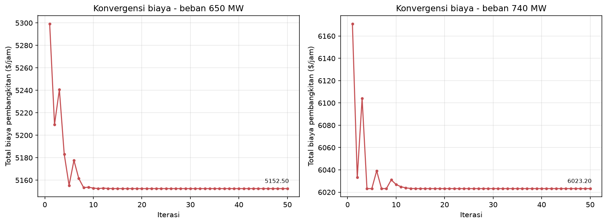
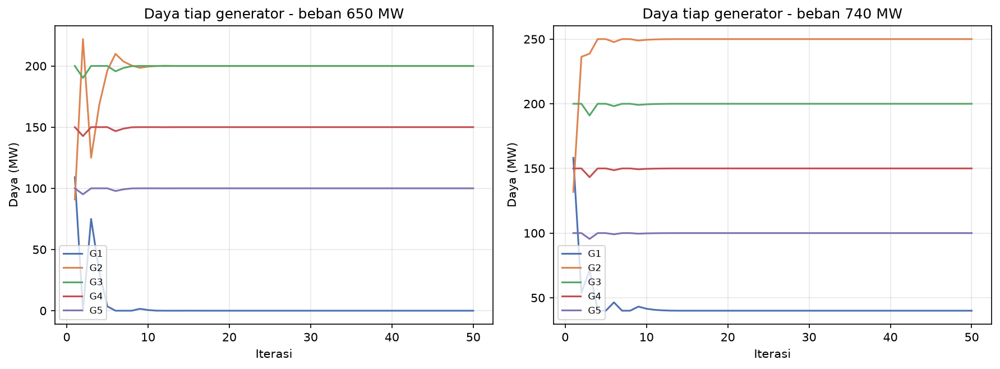

# Economic Dispatch 5 Pembangkit dengan Metode *Lambda-Iteration*

**Eval CPS — Tugas Economic Dispatch**

---

## 1. Deskripsi Masalah

*Economic dispatch* (ED) menentukan daya keluaran setiap generator agar **total biaya
pembangkitan minimum** sambil memenuhi beban sistem dan batas operasi tiap unit. Fungsi
biaya tiap generator berbentuk kuadratik:

$$C_i(P_i) = a_i P_i^2 + b_i P_i + c_i \quad (\$/\text{jam}).$$

Masalah optimasi:

$$\min \; \sum_{i=1}^{5} C_i(P_i)
\quad\text{dengan kendala}\quad
\sum_{i=1}^{5} P_i = P_D, \qquad P_i^{\min} \le P_i \le P_i^{\max}.$$

**Tabel 1. Data lima pembangkit (biaya kuadratik dan batas daya).**

| Gen | P_min (MW) | P_max (MW) | a | b | c |
|---|---:|---:|---:|---:|---:|
| G1 | 0 | 300 | 0,002 | 10 | 100 |
| G2 | 0 | 250 | 0,003 | 8  | 120 |
| G3 | 0 | 200 | 0,004 | 6  | 150 |
| G4 | 0 | 150 | 0,005 | 5  | 180 |
| G5 | 0 | 100 | 0,006 | 4  | 200 |

Ketiga koefisien biaya pada Tabel 1 memiliki makna fisik sebagai berikut:

- **$c_i$ --- biaya tetap (*fixed/no-load cost*), satuan \$/jam.** Biaya yang tetap muncul selama unit menyala meski keluaran daya kecil (menjaga boiler/turbin tetap siap, biaya operasional dasar); tidak bergantung pada $P_i$.
- **$b_i$ --- koefisien biaya linear, satuan \$/MWh.** Mewakili komponen biaya yang sebanding dengan daya (mendekati biaya bahan bakar per satuan energi). Nilai $b$ yang lebih kecil berarti unit lebih murah di margin, sehingga diprioritaskan lebih dulu.
- **$a_i$ --- koefisien biaya kuadratik, satuan \$/MWh$^2$.** Menangkap efek *efisiensi menurun*: makin tinggi daya, biaya tambahan per MW makin naik. Suku ini membuat kurva biaya *konveks* sehingga *economic dispatch* memiliki solusi optimum tunggal.

Konsekuensinya, biaya marjinal (*incremental cost*) tiap unit adalah $dC_i/dP_i = 2a_i P_i + b_i$: $b_i$ adalah biaya marjinal saat daya nol dan $2a_i P_i$ adalah kenaikannya seiring bertambahnya daya --- besaran inilah yang disamakan menjadi $\lambda$ pada metode *lambda-iteration*.

Beban yang dioptimalkan: $P_D = 650$ MW dan $P_D = 740$ MW. Keduanya layak karena
$\sum P^{\min}=0 \le P_D \le \sum P^{\max}=1000$ MW.

---

## 2. Pemilihan Metode

Fungsi biaya berbentuk kuadratik dengan kendala linear, sehingga masalah ini **konveks**
dan memiliki solusi optimal *eksak dan tunggal*. Untuk kasus seperti ini, metode
***lambda-iteration*** adalah pilihan paling tepat karena:

1. menemukan optimum global secara pasti (bukan hampiran stokastik);
2. bersifat iteratif sehingga sesuai dengan ketentuan *iterasi maksimum = 50* dan langsung
   menghasilkan **kurva biaya terhadap iterasi** yang diminta;
3. merupakan metode baku *economic dispatch* pada literatur sistem tenaga (Wood & Wollenberg);
4. hasilnya dapat diverifikasi manual melalui syarat kesamaan *incremental cost*.

Metode metaheuristik (PSO/GA) tidak diperlukan karena masalah konveks ini tidak memiliki
banyak optimum lokal; QP satu-langkah tidak menghasilkan jejak per-iterasi yang diminta tugas.

---

## 3. Metode Optimasi: *Lambda-Iteration*

Pada titik optimum (tanpa rugi saluran), *incremental cost* setiap unit yang tidak berada
di batas bernilai sama, yaitu sebesar $\lambda$:

$$\frac{dC_i}{dP_i} = 2a_i P_i + b_i = \lambda
\;\Longrightarrow\;
P_i(\lambda) = \mathrm{clip}\!\left(\frac{\lambda - b_i}{2a_i},\; P_i^{\min},\; P_i^{\max}\right).$$

Secara satuan, $\lambda$ adalah *incremental cost* (biaya marjinal), yaitu turunan biaya ($/jam) terhadap daya (MW), sehingga bersatuan **$/MWh** — biaya untuk memasok satu MW tambahan.

Nilai $\lambda$ dicari secara iteratif (**bisection**) agar keseimbangan daya
$\sum_i P_i(\lambda) = P_D$ terpenuhi:

1. Tetapkan selang awal $[\lambda_{\text{lo}}, \lambda_{\text{hi}}]$ dari rentang
   *incremental cost* semua unit.
2. Ambil $\lambda = \tfrac{1}{2}(\lambda_{\text{lo}}+\lambda_{\text{hi}})$, hitung
   $P_i(\lambda)$ dan $\sum_i P_i$.
3. Jika $\sum_i P_i > P_D$ turunkan $\lambda_{\text{hi}}=\lambda$; jika $\sum_i P_i < P_D$
   naikkan $\lambda_{\text{lo}}=\lambda$.
4. Ulangi sampai **iterasi maksimum = 50**. Biaya total dan daya tiap unit dicatat pada
   setiap iterasi untuk grafik konvergensi.

---

## 4. Hasil Optimasi

### 4.1 Beban $P_D = 650$ MW

Nilai konvergen: $\lambda = 9{,}20$ \$/MWh, total biaya **= 5152,50 \$/jam**.

**Tabel 2. Dispatch optimal pada beban 650 MW.**

| Gen | P_i (MW) | IC = 2aP+b | C_i (\$/jam) | Status |
|---|---:|---:|---:|---|
| G1 | 0,00   | 10,00 | 100,00  | di P_min |
| G2 | 200,00 | 9,20  | 1840,00 | bebas (IC=\$\\lambda\$) |
| G3 | 200,00 | 7,60  | 1510,00 | di P_max |
| G4 | 150,00 | 6,50  | 1042,50 | di P_max |
| G5 | 100,00 | 5,20  | 660,00  | di P_max |
| **Total** | **650,00** | | **5152,50** | |

### 4.2 Beban $P_D = 740$ MW

Nilai konvergen: $\lambda = 10{,}16$ \$/MWh, total biaya **= 6023,20 \$/jam**.

**Tabel 3. Dispatch optimal pada beban 740 MW.**

| Gen | P_i (MW) | IC = 2aP+b | C_i (\$/jam) | Status |
|---|---:|---:|---:|---|
| G1 | 40,00  | 10,16 | 503,20  | bebas (IC=\$\\lambda\$) |
| G2 | 250,00 | 9,50  | 2307,50 | di P_max |
| G3 | 200,00 | 7,60  | 1510,00 | di P_max |
| G4 | 150,00 | 6,50  | 1042,50 | di P_max |
| G5 | 100,00 | 5,20  | 660,00  | di P_max |
| **Total** | **740,00** | | **6023,20** | |

---

## 5. Grafik Konvergensi

Grafik berikut menampilkan **total biaya pembangkitan terhadap iterasi** (sumbu-x =
iterasi, sumbu-y = biaya) untuk kedua beban. Metode *lambda-iteration* meredam osilasi
awal dan konvergen stabil dalam kurang dari 15 iterasi, lalu tetap konstan hingga iterasi
ke-50.

*Gambar 1. Konvergensi total biaya pembangkitan vs iterasi.*

*Gambar 2. Perubahan daya tiap generator sepanjang iterasi.*

---

## 6. Analisis

- **Urutan prioritas pembangkitan** mengikuti koefisien biaya marjinal. Karena $b$ menurun
  dari G1 ($b=10$) ke G5 ($b=4$), unit termurah di margin (G5, G4, G3) dibebani hingga
  $P^{\max}$ lebih dulu, sedangkan unit termahal (G1) baru dihidupkan ketika beban cukup besar.
- Pada **650 MW**, G1 mati ($P=0$); hanya G2 yang menjadi unit *bebas* sehingga *incremental
  cost*-nya tepat sama dengan $\lambda=9,20$. Unit lain yang berada di batas boleh memiliki
  $IC \ne \lambda$ — ini konsisten dengan syarat Karush–Kuhn–Tucker ketika kendala batas aktif.
- Pada **740 MW**, beban tambahan 90 MW diserap dengan menaikkan G2 ke $P^{\max}=250$ dan
  menghidupkan G1 sebesar 40 MW ($IC_{G1}=\lambda=10{,}16$).
- **Kenaikan biaya** dari 650 MW ke 740 MW sebesar **870,70 \$/jam** (= 6023,20 − 5152,50)
  untuk tambahan 90 MW (sekitar **9,67 \$/MWh** rata-rata), sejalan dengan rentang $\lambda$
  yang naik dari 9,20 menjadi 10,16 \$/MWh.
- **Konvergensi:** *bisection* pada $\lambda$ sendiri konvergen monoton (selang menyempit tiap iterasi). Lonjakan kecil pada kurva biaya iterasi awal (mis. beban 740 MW di iterasi ke-6—9) adalah **artefak pelaporan**: biaya dihitung pada dispatch yang telah diproyeksikan agar jumlah $P_i=P_D$ meskipun $\lambda$ belum presisi — **bukan** ketidakstabilan metode. Setelah $\lambda$ konvergen (<15 iterasi), biaya stabil dan pada iterasi ke-50 identik dengan solusi optimal.

---

## 7. Verifikasi Silang (Validasi Hasil)

Untuk memastikan solusi *lambda-iteration* benar-benar optimum global (bukan terjebak di titik suboptimal), hasil dibandingkan dengan *solver* optimasi independen **SLSQP** (`scipy.optimize`) pada problem yang sama. Kedua metode memberikan hasil **identik**:

| | Beban 650 MW | Beban 740 MW |
|---|---:|---:|
| Lambda-iteration ($/jam) | 5152,50 | 6023,20 |
| SLSQP ($/jam) | 5152,50 | 6023,20 |
| Selisih | 0,00 | 0,00 |

Kesamaan ini mengonfirmasi bahwa dispatch yang diperoleh adalah **optimum global** untuk kedua beban.

---

## 8. Kesimpulan

Dengan metode *lambda-iteration* (maks 50 iterasi), diperoleh dispatch ekonomis:

| | Beban 650 MW | Beban 740 MW |
|---|---|---|
| $\lambda$ (\$/MWh) | 9,20 | 10,16 |
| **Total biaya (\$/jam)** | **5152,50** | **6023,20** |
| $(P_{G1},\dots,P_{G5})$ (MW) | (0, 200, 200, 150, 100) | (40, 250, 200, 150, 100) |

Perhitungan dan grafik dihasilkan oleh `economic_dispatch.ipynb` (Python); seluruh angka
berasal dari eksekusi nyata, dapat direproduksi.
