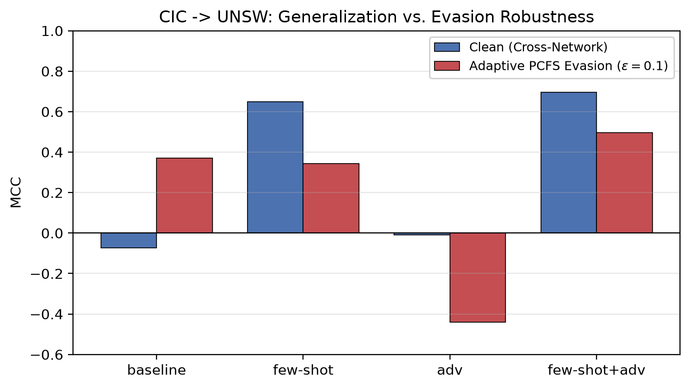
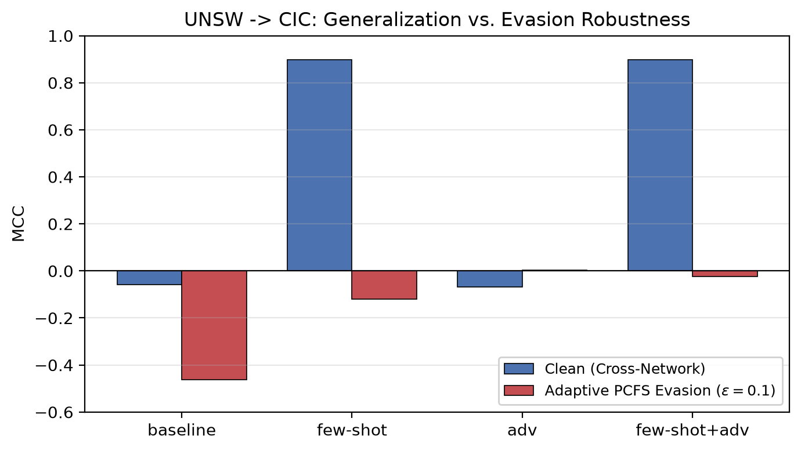

# Dokumentasi Percobaan — Paper 2 (Adversarial Robustness NIDS)

> **Fungsi file ini:** memori persisten + laporan hasil Paper 2. Kalau konteks
> hilang/reset, BACA FILE INI DULU. Struktur file (satu dokumen utuh, tanpa
> pengulangan):
> - **Bagian I — Laporan Hasil** (A–J): narasi + rumus + tabel + grafik, dibaca runut
>   dari atas ke bawah. Baca dengan Markdown Preview (`Ctrl+Shift+V`).
> - **Bagian II — Memori Operasional** (K–P): peta notebook↔tabel, status reviewer,
>   tugas tersisa, cara ambil S3, konvensi kerja.
>
> **Untuk operasi AWS (deploy/serangan/inferensi):** lihat `aws/adv-runbook.md`.
> **PETA MEMORI (2 file per paper).** Ini **Paper 2** (adversarial, lanjutan Paper 1):
> file ini + `aws/adv-runbook.md`. **Paper 1** (SFM + few-shot) di `documentation.md` +
> `aws/runbook.md`. Sumber kebenaran detail tetap notebook (`notebooks/`) + `git log`.
>
> **Identitas:** file utama `unswnb-15/paper2-adversarial.tex`; judul *Adversarial
> Robustness of Cross-Network Intrusion Detection via Semantic Mapping and Few-Shot
> XGBoost*; penulis Hero Yudo Martono, Iwan Syarif, Ferry Astika Saputra; isi Indonesia
> (istilah/judul/caption/highlights Inggris); bibliografi `thebibliography` manual;
> compile pdfLaTeX 2× di Overleaf (butuh folder `figure-p2/`); target JISA-like
> (Elsevier); angka desimal koma di `.tex`.

---

# BAGIAN I — LAPORAN HASIL (baca runut)

> Angka memakai titik desimal di sini (gaya tabel markdown); di naskah `.tex` koma.
> Semua angka dari eksperimen nyata (notebook 11–16 + validasi AWS). Lihat peta
> notebook↔tabel (Bagian L) untuk sumber tiap angka.

## A. Tujuan & pertanyaan riset

Paper 2 melanjutkan Paper 1. Paper 1 menjawab **sumbu generalisasi** (model NIDS
runtuh lintas-jaringan karena *distribution shift*, dipulihkan dengan *few-shot*).
Paper 2 menambah **sumbu kedua — ketahanan terhadap serangan *evasion* adversarial** —
dan menyelidiki **interaksi** keduanya.

**Pertanyaan:** Dapatkah satu XGBoost ringan (9 fitur SFM) sekaligus (a) menjaga
generalisasi lintas-jaringan (via *few-shot*) dan (b) tahan *evasion* (via
*adversarial training*)? Dan mengapa ketahanannya **bersyarat pada arah**
sumber→target?

## B. Setup eksperimen

- **Model:** XGBoost biner. `max_depth=8, lr=0.1, n_estimators=200,
  subsample=colsample=0.8, tree_method=hist`.
- **9 fitur SFM:** duration, fwd_pkts, bwd_pkts, fwd_bytes, bwd_bytes, fwd_mean,
  bwd_mean, src_load, dst_load. (Mapping kolom CIC idx0 / UNSW idx1 → `MAP_A` di nb14.)
- **z-score:** StandardScaler di-*fit* pada train sumber saja, lalu *transform* ke
  uji/target/AWS (tanpa kebocoran).
- **4 varian pelatihan:** `baseline` | `few-shot` (+1% label target) |
  `adv` (adversarial training FGSM, ratio 0.20, eps_train 0.1) | `few-shot+adv` (usulan).
- **5 seed:** {13, 42, 101, 202, 303} — semua angka berbasis-seed = rata-rata (±std/CI/p).
- **Suite serangan:** FGSM 1-langkah → PGD iteratif (iter=10, alpha=0.02, L∞-ball) →
  AutoAttack/tree-specific (future work). eps evaluasi {0.05, 0.1, 0.2}.
- **Arah:** A→B = latih di A, uji di B. Dua arah: CIC→UNSW dan UNSW→CIC.
- **Kontrol kebocoran:** 1% few-shot HANYA dari partisi train target; clean-target
  dievaluasi hanya di test disjoint. D_tgt = D_calib ⊔ D_test.

### Dataset (angka nyata, `dataset_stats.csv`)

| Dataset | Total | Attack | Benign |
|---|---:|---:|---:|
| CSE-CIC-IDS2018 (semua) | 1.623.261 | 274.808 | 1.348.453 |
| UNSW-NB15 train | 175.341 | 119.341 | 56.000 |
| UNSW-NB15 test | 82.332 | 45.332 | 37.000 |
| UNSW-NB15 total | 257.673 | 164.673 | 93.000 |
| AWS (trafik nyata, self-labelled) | 17.753 | 17.620 | 133 |

## C. Rumus-rumus kunci

**1. FGSM (Fast Gradient Sign Method).** Perturbasi satu langkah searah tanda gradien
loss terhadap fitur:

```
x_adv = x + eps * sign( grad_x L(f(x), y) )
```

XGBoost berbasis pohon (tak terdiferensialkan) → gradien diperkirakan dengan
**finite-difference saliency** (h = 0.01) per fitur.

**2. PGD (Projected Gradient Descent).** Versi iteratif FGSM (iter=10, alpha=0.02),
tiap langkah diproyeksikan kembali ke bola L∞ berjari-jari eps:

```
x_(t+1) = Proj_{||x'-x||_inf <= eps} ( x_t + alpha * sign( grad_x L ) )
```

**3. PCFS (Protocol-Consistent Feature Space).** Proyeksi agar perturbasi tetap sah
secara fisik jaringan (bukan klaim deliverability, hanya konsistensi ruang-fitur):
`x >= 0`, jumlah paket bilangan bulat, `bytes >= packets`, `mean = bytes/packets`,
laju `load = bytes/duration` direkonsiliasi, serta **monotonik add-only** (penyerang
hanya boleh menambah, tak mengurangi).

**4. MCC (Matthews Correlation Coefficient)** — metrik utama (tahan imbalance):

```
MCC = (TP*TN - FP*FN) / sqrt( (TP+FP)(TP+FN)(TN+FP)(TN+FN) )
```

**5. ASR (Attack Success Rate)** — proporsi serangan yang lolos deteksi setelah
diperturbasi (makin kecil makin baik); dilaporkan karena MCC bisa menutupi evasion.

## D. Hasil 1 — Empat varian: generalisasi (5 seed)

MCC *clean* lintas-jaringan (rata-rata 5 seed). **Generalisasi hanya dari few-shot,
bukan adversarial training.** (Sumber: nb11/12 `tab:p2main`, nb14 `tab:fewshot_seeds`.)

| Arah | baseline | few-shot | adv | few-shot+adv |
|---|---:|---:|---:|---:|
| CIC→UNSW (clean target) | ~0 | 0.650 ± 0.016 | −0.010 | 0.662 ± 0.012 |
| UNSW→CIC (clean target) | ~0 | 0.899 ± 0.004 | −0.067 | 0.898 ± 0.004 |

Varian `adv` (tanpa few-shot) gagal menutup celah lintas-jaringan (seperti Paper 1);
`few-shot` dan `few-shot+adv` memulihkan MCC ke 0.65–0.90. Menambah adversarial
training **tidak merusak** generalisasi (paritas few-shot vs few-shot+adv).

## E. Hasil 2 — Uji signifikansi (paired t-test, 5 seed)

Apakah few-shot+adv berbeda signifikan dari few-shot? (`significance_fewshot_vs_adv.csv`)

| Arah | Kondisi | Δ (adv − few-shot) | p-value | Signifikan? |
|---|---|---:|---:|:--:|
| CIC→UNSW | clean | +0.011 | 0.241 | tidak |
| CIC→UNSW | FGSM ε=0.1 | −0.039 | 0.735 | tidak |
| CIC→UNSW | **PGD ε=0.1** | **−0.222** | **0.012** | **ya (MERUGIKAN)** |
| UNSW→CIC | clean | −0.001 | 0.446 | tidak |
| UNSW→CIC | **FGSM ε=0.1** | **+0.389** | **0.003** | **ya (MEMBANTU)** |
| UNSW→CIC | **PGD ε=0.1** | **+0.302** | **0.033** | **ya (MEMBANTU)** |

**Temuan inti (jujur, kekuatan paper):** adversarial training **tidak universal** —
signifikan **membantu** di UNSW→CIC, tapi signifikan **merugikan** di CIC→UNSW di bawah
PGD (gejala *robust overfitting* ke serangan 1-langkah).

## F. Hasil 3 — Metrik keamanan (ASR mengungkap apa yang MCC sembunyikan)

Serangan adaptif PCFS ε=0.1 (`reviewer_agg.csv`). ASR = laju serangan lolos.

| Arah | Varian | Serangan | MCC | ASR↓ | recall |
|---|---|---|---:|---:|---:|
| CIC→UNSW | few-shot | FGSM | 0.493 | **0.020** | 0.960 |
| CIC→UNSW | few-shot | PGD | 0.524 | 0.017 | 0.959 |
| UNSW→CIC | few-shot | FGSM | −0.169 | **0.985** | 0.013 |
| UNSW→CIC | few-shot+adv | FGSM | 0.219 | 0.872 | 0.125 |
| UNSW→CIC | few-shot+adv | PGD | 0.178 | 0.738 | 0.240 |

**Baca:** di CIC→UNSW, MCC few-shot "turun" (0.65→0.49) tapi ASR cuma 0.02 → nyaris
tak ada evasion (penurunan MCC dari sedikit false-positive, bukan serangan lolos).
Di UNSW→CIC, ASR few-shot = 0.985 → hampir semua serangan lolos (keruntuhan nyata).
Di sinilah adversarial training memberi nilai terukur: ASR turun 0.985→0.872 (FGSM)
dan 0.938→0.738 (PGD).

### Metrik perturbasi & validitas (`perturbation_metrics.csv`)

Serangan *sparse*: hanya ~2.6–5.4 dari 9 fitur termodifikasi per flow. Valid-flow rate
0.79–1.0 (PCFS menjaga validitas). FPR target UNSW ~0.33 (balanced-acc 0.82) vs target
CIC ~0.015 (balanced-acc 0.95). Magnitudo L∞/L2 mentah **tidak** dilaporkan sebagai
angka tunggal (tak sebanding antar-fitur karena skala load tak-ternormalisasi).

## G. Hasil 4 — Perbandingan pertahanan alternatif (nb16, 5 seed)

Semua dibangun **di atas few-shot**, diuji pada sumbu ketahanan sama (PCFS FGSM/PGD
ε=0.1). (`defense_baselines_agg.csv`)

| Arah | Pertahanan | clean MCC | FGSM ε=0.1 | PGD ε=0.1 |
|---|---|---:|---:|---:|
| CIC→UNSW | few-shot (tanpa pertahanan) | 0.650 | 0.493 | 0.524 |
| CIC→UNSW | **few-shot+adv (FGSM, usulan)** | 0.660 | 0.523 | 0.346 |
| CIC→UNSW | few-shot+adv (PGD-AT) | 0.647 | 0.567 | 0.558 |
| CIC→UNSW | few-shot+Gaussian-aug | 0.632 | 0.441 | 0.330 |
| CIC→UNSW | few-shot+rand-smoothing | 0.485 | 0.337 | 0.346 |
| UNSW→CIC | few-shot (tanpa pertahanan) | 0.900 | −0.167 | −0.121 |
| UNSW→CIC | **few-shot+adv (FGSM, usulan)** | 0.897 | 0.276 | −0.029 |
| UNSW→CIC | few-shot+adv (PGD-AT) | 0.896 | −0.002 | −0.330 |
| UNSW→CIC | few-shot+Gaussian-aug | 0.894 | 0.037 | 0.210 |
| UNSW→CIC | few-shot+rand-smoothing | 0.169 | −0.097 | −0.068 |

**Temuan:** (1) semua pertahanan menjaga clean MCC **kecuali** randomized smoothing
(menggerus ke 0.485 / runtuh ke 0.169). (2) Tak ada pertahanan menang di semua sumbu:
PGD-AT terbaik di CIC→UNSW-PGD (0.558) tapi berbiaya tinggi; FGSM-usulan terbaik di
UNSW→CIC-FGSM (0.276, satu-satunya positif berarti). (3) Di bawah PGD arah UNSW→CIC
semua ≤0.21 → tetap masalah terbuka. Kesimpulan: FGSM few-shot+adv = keseimbangan
terbaik generalisasi/ketahanan/biaya, tanpa klaim dominasi universal.

## H. Hasil 5 — Validasi 3-tahap di trafik AWS nyata (nb15, offline, 5 seed)

Membuktikan pipeline usulan transfer ke domain **ketiga** (AWS), bukan hanya
antar-benchmark. (`aws_stages_agg.csv`)

| Arah | Tahap | MCC clean | recall | precision |
|---|---|---:|---:|---:|
| CIC→AWS | S0 zero-shot | 0.001 | 0.000 | 0.80 |
| CIC→AWS | S1 +1% few-shot | 0.184 | 0.970 | 0.995 |
| CIC→AWS | S2 +1% few-shot +adv | **0.246** | 0.966 | 0.997 |
| UNSW→AWS | S0 zero-shot | 0.052 | 0.997 | 0.993 |
| UNSW→AWS | S1 +1% few-shot | 0.026 | 0.999 | 0.993 |
| UNSW→AWS | S2 +1% few-shot +adv | **0.143** | 0.996 | 0.994 |

**Temuan:** few-shot 1% memulihkan recall CIC→AWS dari 0.00 ke 0.97 (kalibrasi domain
bekerja di cloud nyata). MCC absolut rendah karena imbalance ekstrem (17.620 attack :
133 benign) → recall/precision lebih informatif (≥0.96). Ketahanan adversarial S2 di
AWS tetap lemah (MCC −0.04..0.07, ASR CIC 0.835) → few-shot memulihkan generalisasi,
bukan evasion. Dilaporkan apa adanya.

## H2. Hasil 7 — Bukti empiris mekanisme "sel keputusan sempit" (nb17)

Mengubah hipotesis geometri batas keputusan pohon dari spekulatif jadi terukur, pada
model few-shot, data uji target. (`decision_cell.csv`, grid pencarian Δε=0.002)

| Target domain | κ (konsentrasi) | w (lebar sel) | d_boundary | P_cross(0.1) | #leaf |
|---|---:|---:|---:|---:|---:|
| UNSW (high-variance) | 5.00 | 3.5×10⁻⁴ | 4.0×10⁻³ | 0.091 | 24944 |
| CIC (low-variance)   | 5.76 | ≈0 (1.6×10⁻¹⁰) | **2.0×10⁻³** | **0.237** | 21380 |

- **κ** = IQR/median (makin kecil makin homogen); **w** = jarak median sampel ke ambang
  split terdekat (z-score); **d_boundary** = perturbasi minimum (arah saliency, PCFS)
  yang membalik prediksi; **P_cross(0.1)** = fraksi sampel yang prediksinya berubah di
  ε=0.1.

**Temuan (3 dari 4 ukuran mendukung, dilaporkan jujur):** mekanisme "sel CIC lebih
sempit → lebih mudah ditembus" didukung oleh **tiga ukuran langsung** — w (CIC ≈0 ≪
UNSW), d_boundary (CIC 0.002 = separuh UNSW 0.004), dan P_cross (CIC 0.237 ≫ UNSW
0.091). Ketiganya searah dengan keruntuhan adaptive UNSW→CIC. **Hanya κ yang tidak
searah** (CIC 5.76 > UNSW 5.00) — IQR/median bukan proksi homogenitas yang tajam untuk
pasangan domain ini; dilaporkan apa adanya, tidak dipaksakan. Catatan: d_boundary
awalnya terkunci di 0.020 pada grid kasar Δε=0.02; perhalusan grid ke 0.002 membuat
perbedaan sesungguhnya tampak. Jumlah leaf serupa (24944 vs 21380) → perbedaan bukan
granularitas pohon melainkan **posisi** sampel relatif terhadap ambang split.

## I. Grafik: generalisasi vs ketahanan per arah

Dua gambar (`figure-p2/`) merangkum trade-off generalisasi (clean MCC) vs ketahanan
adaptif PCFS ε=0.1 untuk keempat varian.



*Gambar 1. CIC→UNSW — few-shot memulihkan generalisasi; ketahanan adaptif bervariasi
antar-varian.*



*Gambar 2. UNSW→CIC — few-shot menjaga generalisasi (0.897) tetapi ketahanan adaptif
tetap runtuh di arah ini untuk semua varian (temuan asimetri, dilaporkan apa adanya).*

## J. Kesimpulan (empat pesan utama, hasil campuran yang jujur)

1. **Generalisasi lintas-jaringan hanya dari few-shot**, bukan adversarial training.
2. **Adversarial training di atas few-shot tidak merusak generalisasi** (paritas).
3. **Ketahanan adaptif asimetris terhadap arah** sumber→target.
4. **Adversarial training tidak universal:** signifikan MEMBANTU di UNSW→CIC,
   signifikan MERUGIKAN di CIC→UNSW-PGD (robust overfitting ke serangan 1-langkah).

> Pesan metodologis: melaporkan hasil campuran secara jujur (termasuk arah yang gagal)
> adalah **kekuatan** paper — memetakan kapan pertahanan membantu vs merugikan, bukan
> klaim universal yang rapuh.

> **Catatan single-run (nb12, bukan 5 seed — untuk sanity-check `tab:p2main`):**
> CIC→UNSW few-shot+adv clean 0.696 / adaptive 0.495; UNSW→CIC few-shot+adv clean
> 0.897 / adaptive −0.025. (Tabel utama paper memakai angka 5-seed di atas.)

---

# BAGIAN II — MEMORI OPERASIONAL (untuk kerja, bukan laporan)

## K. Prinsip reproduksi

> Notebook **11–17 SEMUA milik Paper 2** (notebook ≤10 milik Paper 1, mis.
> `10_wasserstein_shift.ipynb`). **JANGAN membuat notebook/sel baru yang menghitung
> ulang hasil yang sudah ada.** Sebelum menambah eksperimen, cek peta di Bagian L —
> kemungkinan besar sudah ada.

Output notebook → `paper2_reviewer_out/` + S3
`s3://ssh-detection-features-232032302717/unsw-far/paper2_reviewer/`.
Data sumber (path SageMaker): `../../CICDDoS2018/data/cleaned_100.pkl`,
`../data/UNSW_NB15_{testing,training}-set.csv`,
`aws_labeled/detect_{clean,volumetric}_flows.csv` (9 fitur + ground_truth; ter-track git).

## L. Peta NOTEBOOK ↔ TABEL

| Notebook | Peran | Menghasilkan | Tabel di paper |
|---|---|---|---|
| `11_adv_fewshot_pipeline.ipynb` | INTI: latih 4 varian × 2 arah; simpan model+scaler ke S3 `unsw-far/paper2/` | paper2_pipeline_meta.json, model+scaler | fondasi semua + deploy AWS |
| `12_adv_evaluation.ipynb` | Evaluasi clean/evasion/adaptive 4 varian (single-run) | paper2_eval_results.json | `tab:p2main` |
| `13_rangkuman_adversarial.ipynb` | Rangkuman + AWS 2-EC2 (sel 5b) | ringkasan, aws JSON | `tab:aws`, `tab:aws_unsw` |
| `14_reviewer_experiments.ipynb` | Revisi reviewer A2/A3/A5/B5 + #8/#10/#14 | reviewer_agg, multiattack, significance, perturbation_metrics, dataset_stats | `tab:multiattack`, `tab:fewshot_seeds`, `tab:significance`, `tab:advmetrics`, `tab:dataset` |
| `15_aws_fewshot_calibration.ipynb` | Validasi 3-tahap AWS (offline) | aws_stages_agg.csv | `tab:aws_stages` |
| `16_defense_baselines.ipynb` | Pembanding pertahanan (PGD-AT/Gaussian/rand-smoothing) | defense_baselines_agg.csv | `tab:defense_baselines` ✅ TERISI |
| `17_decision_cell.ipynb` | Bukti empiris narrow-cell (kappa/w/d_boundary/crossing) | decision_cell.csv | `tab:decisioncell` ✅ TERISI (3/4 ukuran mendukung) |


> **Catatan gambar nb13:** semua teks di dalam figur (judul, label sumbu, legend,
> diagram alur) memakai **Bahasa Inggris** agar langsung dipakai untuk paper & slide;
> teks penjelasan markdown tetap Bahasa Indonesia. nb13 kini memuat **7 blok hasil**
> (termasuk bukti sel-keputusan nb17).

## M. Status revisi reviewer

| # | Isu | Status |
|---|---|---|
| 1 | Adaptive white-box lemah (butuh PGD/suite) | ✅ suite FGSM→PGD→AutoAttack, tab:multiattack |
| 3 | Novelty = kombinasi komponen | ✅ reframe jadi temuan interaksi/rezim asimetris |
| 5 | "functional-preserving" over-claim | ✅ diganti PCFS di seluruh paper |
| 6 | AWS belum validasi pipeline | ✅ nb15 validasi 3-tahap, tab:aws_stages |
| 7 | Leakage few-shot 1% | ✅ D_calib⊔D_test eksplisit + 5 seed |
| 8 | Variance/signifikansi | ✅ tab:significance p-value nyata |
| 9 | Kurang defense baseline | ✅ nb16; **tab:defense_baselines TERISI** |
| 10 | Metrik selain MCC (ASR dll) | ✅ tab:advmetrics + perturbation_metrics |
| 11 | Narrow-cells spekulatif | ✅ nb17 kuantifikasi — **tab:decisioncell TERISI**; w/d_boundary/P_cross mendukung, κ dilaporkan tak-searah |
| 12 | MCC AWS "artefak" | ✅ reframe jadi trade-off sensitivitas-spesifisitas |
| 13 | Threat model formal | ✅ tab:threatmodel |
| 14 | Dataset section tipis | ✅ tab:dataset + paragraf praproses |
| 17 | Hasil buruk = aset | ✅ paragraf "Pesan utama" di conclusion |
| 18 | Judul misleading | ✅ judul (keputusan penulis: judul awal dipertahankan) |
| 19-B4 | Hubungan dgn Paper 1 | ✅ paragraf khusus di related work |
| C | Polishing (bahasa/abstract/highlights) | ⏳ highlights ✅; abstract/referensi menyusul |

Belum pernah muncul dari reviewer: #2, #4, #15, #16.

## N. Tugas tersisa

1. **[✅] `tab:decisioncell` TERISI** dari `decision_cell.csv` (nb17, grid Δε=0.002).
   Hasil: `w^CIC < UNSW` ✓, `d_boundary^CIC < UNSW` ✓ (0.002 vs 0.004),
   `P_cross^CIC > UNSW` ✓; `kappa^CIC < UNSW` ✗ (5.76 > 5.00) — narasi direvisi jujur
   (3 ukuran langsung mendukung, κ tak-searah). Versi EN belum diisi (fokus ID dulu).
2. **[⏳] Polishing prioritas C:** abstract (padatkan, cerminkan angka final), reference
   formatting, nomenklatur/notasi. Paling akhir sebelum submit.
3. **Compile final di Overleaf** + cek tak ada error, tabel muat, gambar tampil.

> **Catatan nb16:** sudah SELESAI (hasil di S3, tab:defense_baselines terisi). nb16
> sempat berat (>3 jam) tapi versi teroptimasi (`N_SMOOTH` 10, `NEVAL=8000`,
> `DUR_MIN`/`LOAD_CAP` clip, guard nan_to_num) sudah menghasilkan output valid.

**Roadmap Paper 3 (belum mulai):** update/retraining online (AWS) terhadap drift —
future work Paper 2. Nanti bikin `documentation_online.md` + runbook (pola sama).

## O. Cara ambil hasil dari S3 (terbukti jalan)

- PowerShell workspace rendering-nya kadang rusak (echo berulang, exit −1) TAPI perintah
  tetap tereksekusi. Solusi: **redirect output ke file lalu baca file dengan read tool.**
- AWS CLI + kredensial user `hero` (akun 232032302717) berfungsi dari workspace.
- Pola download:
  ```
  aws s3 cp s3://ssh-detection-features-232032302717/unsw-far/paper2_reviewer/<file> paper2_reviewer_out/ --region ap-southeast-1 > _dl.txt 2>&1
  ```
- Artefak CSV kecil di-whitelist di `.gitignore` (`!unswnb-15/paper2_reviewer_out/*.csv`,
  `!unswnb-15/notebooks/aws_labeled/*.csv`) supaya ter-track.

## P. Konvensi kerja

- Tiap revisi: edit `.tex` → verifikasi `\begin`/`\end` seimbang + cite↔bibitem cocok →
  commit granular → push `origin/main`.
- JANGAN mengarang angka. Placeholder `--` sampai hasil nyata ada.
- Notebook: docstring pakai `#` (BUKAN triple-quote) — hindari SyntaxError escape di JSON.
  Validasi tiap edit: json.load + ast.parse.
- Angka desimal di `.tex`: koma (`0{,}696`). Di laporan markdown (Bagian I): titik.


---

## Q. Anatomi teknis `13_rangkuman_adversarial.ipynb` (per sel)

> **Tujuan bagian ini:** merekam *apa yang dikerjakan tiap sel* nb13 sehingga isinya
> dapat diketahui **tanpa menjalankan notebook**. nb13 adalah notebook *rangkuman*
> (tidak menghasilkan artefak baru untuk paper) — ia memuat ulang CSV/JSON dari
> notebook 11-17 dan merender tabel + gambar untuk paper & slide. **Semua teks di
> dalam gambar berbahasa Inggris**; teks penjelasan markdown Indonesia. Struktur: 16
> section (0-15), 7 blok hasil (section 4-10). Setiap sel kode diakhiri penanda
> `=== SEL n SELESAI ===`.

**Pola pemuatan data (sel 0).** Mendefinisikan `SEARCH_DIRS` = `['.', 'paper2_reviewer_out',
'../paper2_reviewer_out', 'paper2_eval_out', 'paper2_models', '..']`, lalu helper
`load_json(name)` / `load_csv(name)` yang mencari file di dir-dir itu; bila tidak ada,
mengembalikan `None` sehingga sel memakai **fallback** = angka nyata tertanam (identik
hasil tercatat). Jadi notebook tetap jalan di mana saja; angka tak berubah.

| Sel | Jenis | Yang dikerjakan (teknis) | Sumber data | Output |
|---|---|---|---|---|
| **0. Setup** | code | import matplotlib/pandas/numpy; set `rcParams` (dpi 110); definisikan `SEARCH_DIRS`, `load_json`, `load_csv`. | - | fungsi loader siap |
| **1. Dua sumbu** | md+code | Diagram scatter dua-panel: x=`clean_target` MCC (generalisasi), y=`adaptive_pcfs_eps0.1` MCC (ketahanan). MCC [-1,1] dipetakan `(v+1)/2` ke [0,1] hanya utk tata-letak; label tampilkan MCC asli. Titik nyata `pts_c2u`/`pts_u2c` (dari paper2_eval_results.json). | paper2_eval_results.json (hard-coded nyata) | 2 scatter + tabel ringkas (Inggris) |
| **2. Empat varian** | md+code | Muat `paper2_pipeline_meta.json`; cetak konfigurasi `eps_train=0.1, adv_ratio=0.20, fewshot_frac=0.01`, hyperparameter XGBoost. | paper2_pipeline_meta.json (nb11) | tabel konfigurasi |
| **3. Tiga rezim** | md+code | DataFrame deskriptif 3 rezim: Unconstrained / PCFS / Adaptive white-box (model-aware score-based). Tidak ada komputasi. | - | tabel rezim |
| **3b. Metrik** | md | Definisi TP/TN/FP/FN + rumus Recall, Precision, MCC, ASR (LaTeX). Penjelasan kenapa MCC utama + ASR pendamping. | - | - |
| **4. Hasil 1 (tabel utama)** | md+code | Muat `paper2_eval_results.json` (nb12 single-run); normalkan nama kolom lama `adaptive_functional_eps0.1` -> `adaptive_pcfs_eps0.1`; tampilkan clean_source/clean_target/unconstrained/adaptive. Fallback `FALLBACK_ROWS`. | paper2_eval_results.json | tabel 8 baris |
| **4b. Grafik hasil 1** | code | Bar chart per arah: `clean_target` vs `adaptive_pcfs_eps0.1` (MCC) utk 4 varian, ylim -0.6..1.0. | dari sel 4 | 2 bar chart (Inggris) |
| **5. Hasil 2 (multi-attack)** | md+code | Muat `reviewer_agg.csv`; untuk tiap (arah,model) ambil `mcc_mean` pada kondisi `fgsm_eps{0.05,0.1,0.2}` & `pgd_eps*`; bangun `dfm`. Plot kurva MCC vs eps (FGSM garis penuh `-o`, PGD garis putus `--s`) per arah, warna per varian. Fallback angka nyata. | reviewer_agg.csv (nb14, 5 seed) | tabel + 2 kurva (Inggris) |
| **6. Hasil 3 (signifikansi)** | md+code | Muat `significance_fewshot_vs_adv.csv`; tambah kolom `significant_0.05 = t_p<0.05`; tampilkan. Fallback 6 baris nyata (p-value t-test). | significance_fewshot_vs_adv.csv (nb14) | tabel signifikansi |
| **7. Hasil 4 (ASR+perturbasi)** | md+code | Muat `reviewer_agg.csv`; untuk fewshot & fewshot_adv pada fgsm/pgd eps0.1 ambil MCC/ASR/recall/precision -> `dfA`. Lalu muat `perturbation_metrics.csv` (nmod_mean, valid_flow_rate, fpr, balanced_acc). | reviewer_agg.csv + perturbation_metrics.csv (nb14) | 2 tabel |
| **8. Hasil 5 (defense)** | md+code | Muat `defense_baselines_agg.csv`; mapping `DEF_ORDER`/`DEF_LABEL` (fewshot, fs_adv_fgsm, fs_adv_pgd, fs_gauss_aug, fs_rand_smooth); untuk tiap (arah,defense) ambil mcc_mean pada clean/fgsm_eps0.1/pgd_eps0.1. | defense_baselines_agg.csv (nb16) | tabel pembanding |
| **9. Hasil 6 (AWS 3-tahap)** | md+code | Muat `aws_stages_agg.csv`; mapping `STAGE_LABEL` (S0_zeroshot/S1_fewshot/S2_fewshot_adv); ambil clean MCC/recall/precision + FGSM/PGD eps0.1 utk S2. | aws_stages_agg.csv (nb15) | tabel 3-tahap |
| **10. Hasil 7 (decision-cell)** | md+code | Muat `decision_cell.csv`; tabel kappa/w_eff/d_boundary_med/crossing_p_eps0.10/n_leaf dua arah; bar chart dua-panel d_boundary & P_cross (lebih rendah d_boundary / lebih tinggi P_cross = lebih mudah dievasi). | decision_cell.csv (nb17, grid 0.002) | tabel + 2 bar chart (Inggris) |
| **11. PoC AWS zero-shot** | md+code | DataFrame hasil PoC AWS nyata (hard-coded dari `aws/paper2_aws/*.json`): 2 arah x 4 varian x {clean,evasion} dengan MCC/recall/precision + FGSM PCFS eps0.1. Pivot per arah; sorot UNSW few-shot+adv (recall 0.954). | aws/paper2_aws/*.json | 2 pivot table + sorotan |
| **12. Alur cerita** | md+code | Diagram 7 kotak alur (Motivation -> Foundation -> Question -> 4 variants x 2 directions -> 3 regimes PCFS -> Findings 7 result blocks -> Future work Paper 3) dengan panah. | - | 1 diagram alur (Inggris) |
| **13. Rangkuman temuan** | md | Bullet angka nyata (generalisasi few-shot, adv tak merusak, CIC->UNSW dua-sumbu, UNSW->CIC runtuh, kurva multi-attack, signifikansi, ASR, defense, AWS). | - | - |
| **14. Catatan promotor** | md | Posisi Paper 2 vs isu kausal Paper 1; 4 pesan utama; batas ruang-lingkup nb 11-17. | - | - |
| **15. Kesimpulan final** | md | Ketangguhan dua-sumbu: tabel ringkas bukti + poin kunci + posisi jujur & arah lanjut (Paper 3). | - | - |

**Catatan reproduksi nb13.**
- Semua sel kode **idempoten & aman tanpa data**: bila CSV/JSON tak ditemukan di
  `SEARCH_DIRS`, dipakai fallback angka nyata yang identik dengan artefak S3 — jadi
  tabel/gambar tetap muncul dengan angka benar.
- **Gambar (figur) berbahasa Inggris** (judul, label sumbu, legend, teks diagram) agar
  langsung dipakai di paper/slide; dipastikan 0 teks Indonesia di dalam figur.
- nb13 **tidak menulis artefak** ke `paper2_reviewer_out/` maupun S3 (murni render);
  sumber kebenaran angka tetap notebook 11-17.
- Untuk me-render gambar sebagai berkas (mis. PNG untuk slide), jalankan nb13 sekali di
  Jupyter/SageMaker; ia memuat CSV dari S3/`paper2_reviewer_out/` yang sudah ada.

